# Hi, I'm Nhon Vo 👋

I'm a passionate software developer with a strong interest in **backend development**, **clean architecture**, and **financial data analysis**. I love building scalable applications, optimizing performance, and learning new technologies.

## 🚀 What I Do

- **Backend Development**: I specialize in **.NET Core**, **C#**, and **Entity Framework**.
- **Frontend Development**: Experienced in **TypeScript**, **React**.
- **Data Analysis & Visualization**: I work with **Python**, **Pandas**, and **Plotly** to analyze financial data.
- **Database Management**: Skilled in **SQL Server**, **PostgreSQL**, and **MongoDB**.

## 🌎 Connect with Me

Feel free to reach out and connect with me on:

- **GitHub**: [github.com/nhonvo](https://github.com/nhonvo)
- **LinkedIn**: [linkedin.com/in/truongnhon](https://www.linkedin.com/in/truongnhon/)
- **YouTube**: [@nhonvo-dev](https://www.youtube.com/@nhonvo-dev)
- **Email**: vothuongtruongnhon2002@gmail.com

Thanks for visiting my blog! 🚀

## 🚀 Big Projects

| Project Name                        | Description                                                                                                                     | Tech Stack              | Links                                                                                                                        |
| ----------------------------------- | ------------------------------------------------------------------------------------------------------------------------------- | ----------------------- | ---------------------------------------------------------------------------------------------------------------------------- |
| **Clean Architecture .NET 8.0**     | A web API template built on Clean Architecture principles. Gained over 100 stars on GitHub for its modular and scalable design. | .NET Core               | [Repo](https://github.com/nhonvo/clean-architecture-net-8.0)                                                                 |
| **Personal Finance Management App** | A self-built reporting dashboard using **FastAPI** and **Dash** in Python to track and analyze personal financial data.         | Python, Flash, dash     | [Repo](https://github.com/nhonvo/finance-analysis)                                                                           |
| **BinhDinhFood**                    | An eCommerce website using **.NET MVC** and **SQL Server**, showcasing traditional and selling food from Binh Dinh Province.    | .Net MVC                | [Repo](https://github.com/nhonvo/BinhDinhFood-mvc)                                                                           |
| **Nobita – Happy Digital Bank**     | 1st Prize at HDBank Hackathon. E-wallet app integrated with HDBank API.                                                         | .NET Core & Flutter     | [API Repo](https://github.com/nhonvo/nobita-server) [Mobile Repo](https://github.com/nhonvo/nobita-mobi)                     |
| **Owl Trust – Fake News Filter**    | News reader app helping users access verified information.                                                                      | .NET Core & Flutter     | [API Repo](https://github.com/nhonvo/fake-news-filter-server) [Mobile Repo](https://github.com/nhonvo/fake-news-filter-mobi) |
| **Fresher Management System**       | A web app developed during the FPT Fresher Program to manage trainee profiles, schedules, and examination timelines.            | .Net core, VueJs        | [Repo](https://github.com/nhonvo/fresher-management-system)                                                                  |
| **Fake News Filter Server**         | A research-backed news-reading app built with **.NET Core**, aimed at helping users access verified, credible news sources.     | .Net, .net MVC, flutter | [Repo](https://github.com/nhonvo/fake-news-filter-server)                                                                    |

---

## 🏆 Achievements and Certifications

| Title                                         | Subtitle                                                                                                                           | Image                                                                                        | Tags                              | Link                                                                                                                                                                           |
| --------------------------------------------- | ---------------------------------------------------------------------------------------------------------------------------------- | -------------------------------------------------------------------------------------------- | --------------------------------- | ------------------------------------------------------------------------------------------------------------------------------------------------------------------------------ |
| **MongoDB Certified Associate Developer**     | Mongo                                                                                                                              | 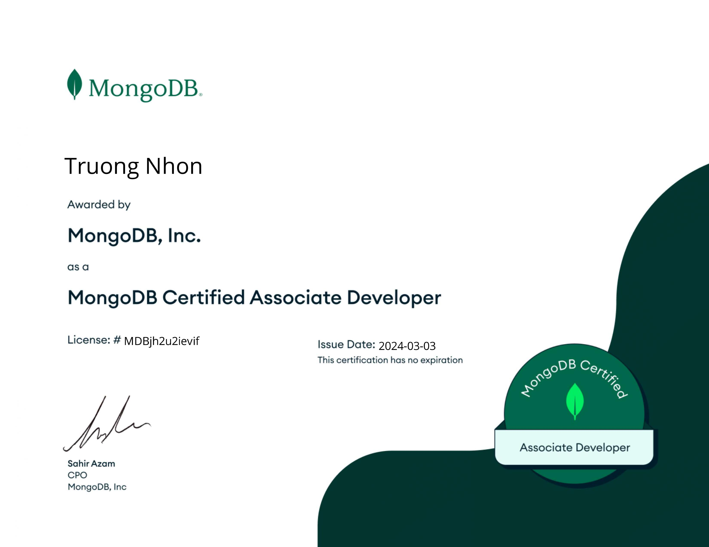                    | nosql, mongo, 2024                | [Link](https://learn.mongodb.com/c/G5hEeS7nRIaWzcVDQkCQFA)                                                                                                                     |
| **SQL**                                       | Udacity SQL                                                                                                                        | 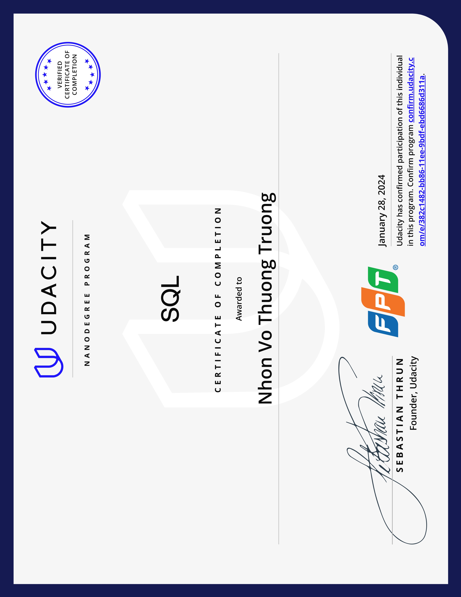                        | sql, postgresql, sql server, 2024 | [Link](https://confirm.udacity.com/e/382c1482-bb86-11ee-9bdf-ebd6686d311a)                                                                                                     |
| **Google Project Management**                 | Project Management with Google's Project Management Certification                                                                  | 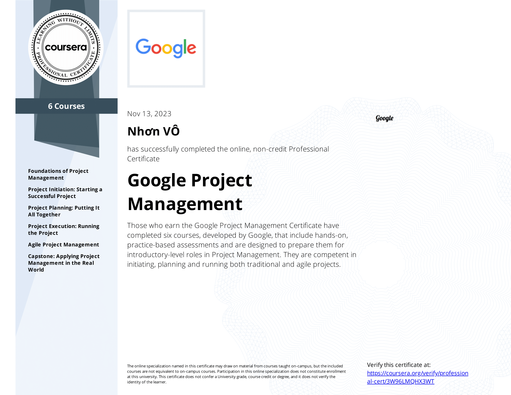               | management, agile/scrum, 2023     | [Link](https://www.coursera.org/account/accomplishments/specialization/certificate/3W96LMQHX3WT)                                                                               |
| **Cloud Developer**                           | Udacity's Cloud Developer about vps, IAM, EC2, ECS, S3                                                                             | 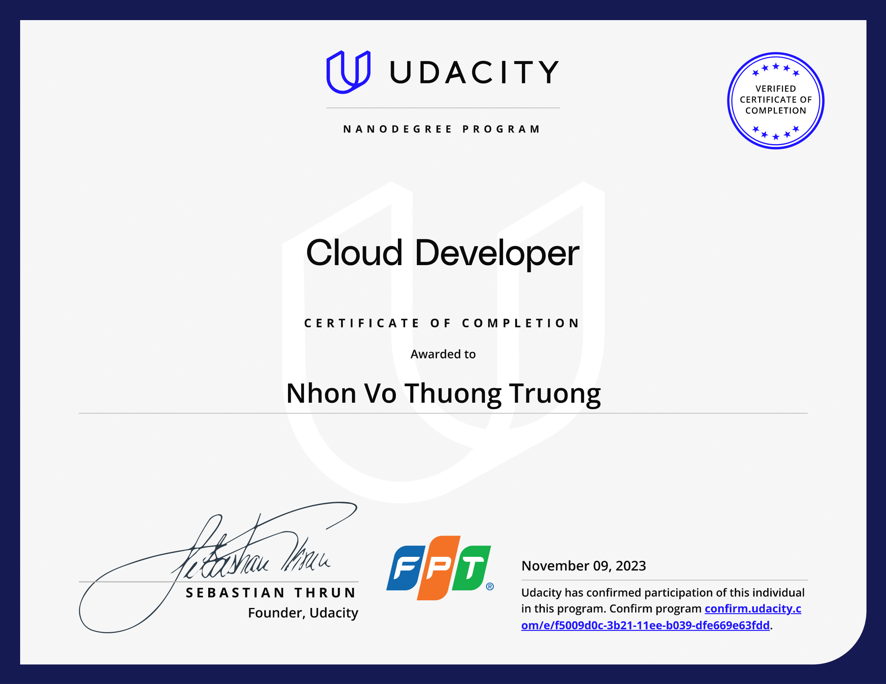                  | aws, cloud, 2023                  | [Link](https://confirm.udacity.com/e/f5009d0c-3b21-11ee-b039-dfe669e63fdd)                                                                                                     |
| **Google Data Analytics**                     |                                                                                                                                    | 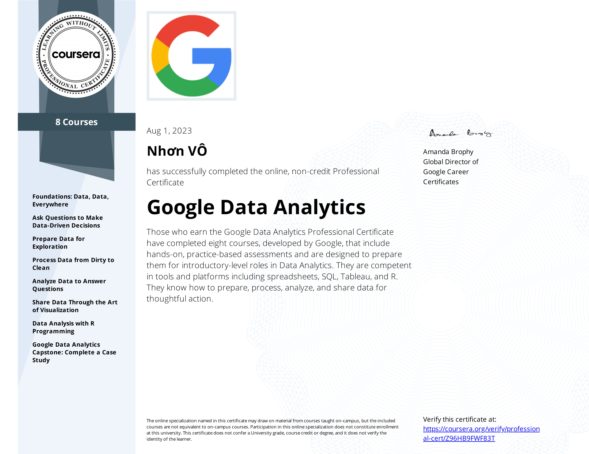                      | data, 2023                        | [Link](https://www.coursera.org/account/accomplishments/specialization/certificate/Z96HB9FWF83T)                                                                               |
| **Student of 5 Merits Level School**          | Acknowledged as a student of 5 merits level school in 2023                                                                         | 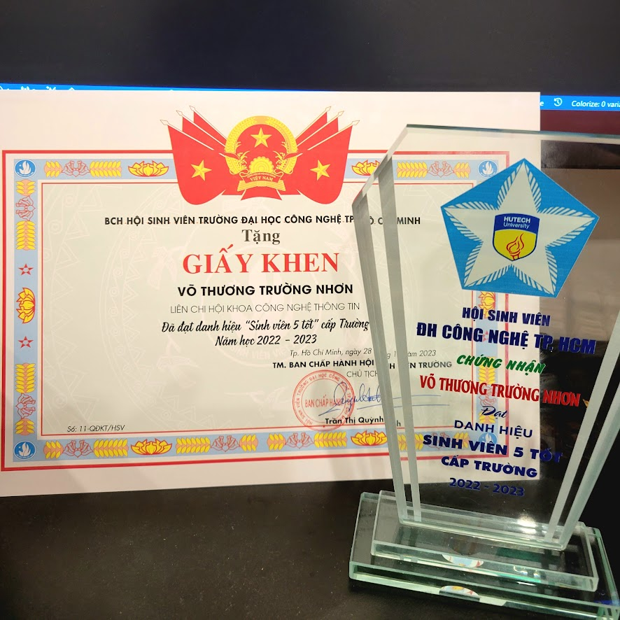 | 2023                              |                                                                                                                                                                                |
| **Student of 5 Merits Level Faculty**         | Acknowledged as a student of 5 merits level faculty in 2023                                                                        | 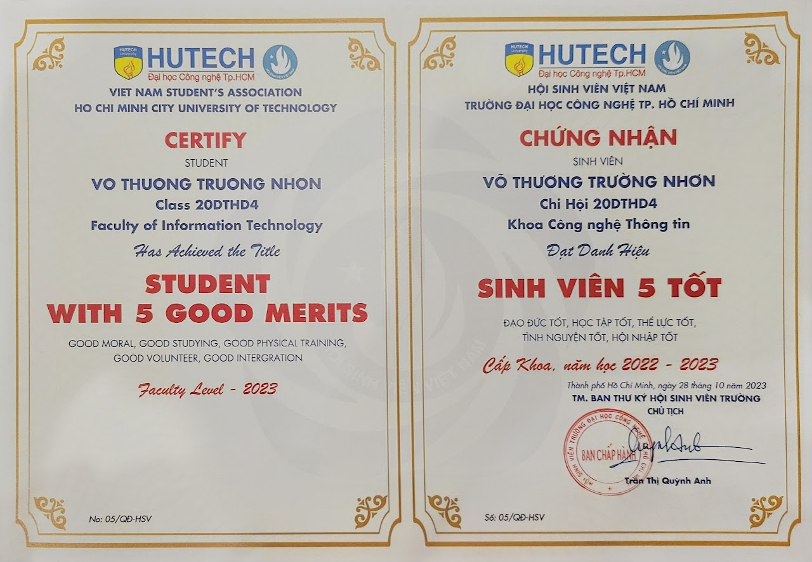                 | 2023                              |                                                                                                                                                                                |
| **Code Your Future Competition 2023**         | Achieved the second prize in Code Your Future 2023 - “Portfolio - Logistics”                                                       | 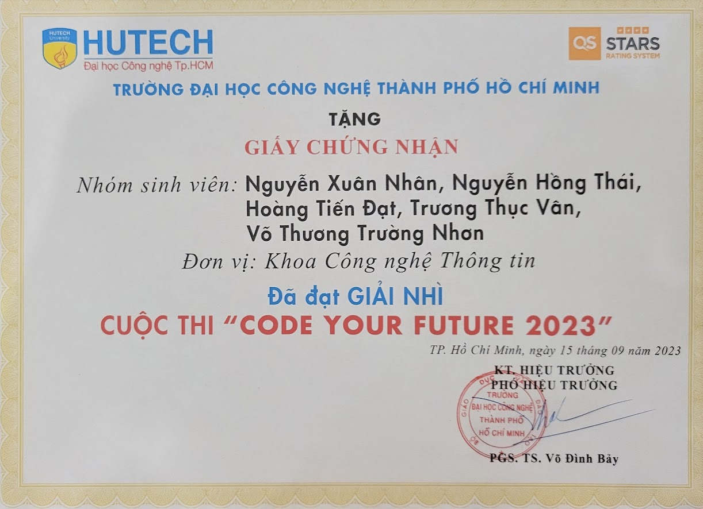                  | 2023                              | [Link](https://www.hutech.edu.vn/khoacntt/tin-tuc/tin-tuc-su-kien/14613378-cuoc-thi-code-your-future-2023)                                                                     |
| **Work at FPT Software - Software Developer** | Start career at FPT Software Academy - Fresh dotnet developer at Year 3 University                                                 | 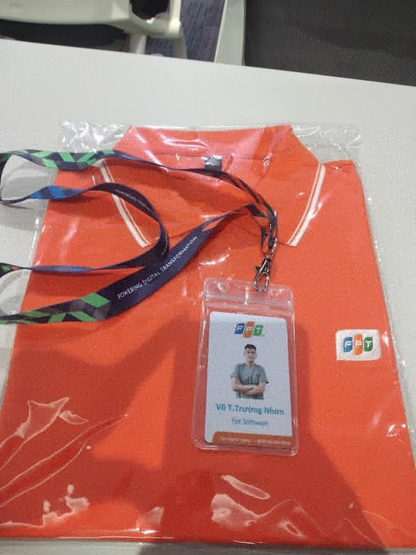                                | 2023                              |                                                                                                                                                                                |
| **IT Got Talent 2022 - Table B**              | Achieved the first prize in IT Got Talent 2022 - Table B with the project "Smart Device & Desktop Application - Nobita Smart Bank" | 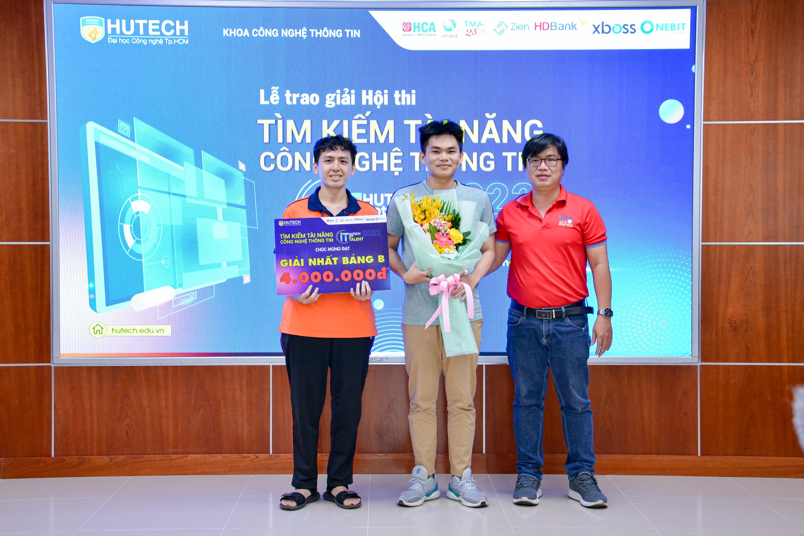                        | 2022                              | [Link](https://www.hutech.edu.vn/khoacntt/tin-tuc/tin-tuc-su-kien/14608074-chung-ket-cuoc-thi-tim-kiem-tai-nang-cntt-2022-hutech-it-got-talent-2022)                           |
| **HDBank Hackathon 2022**                     | Achieved the first prize in HDBank Hackathon 2022                                                                                  | 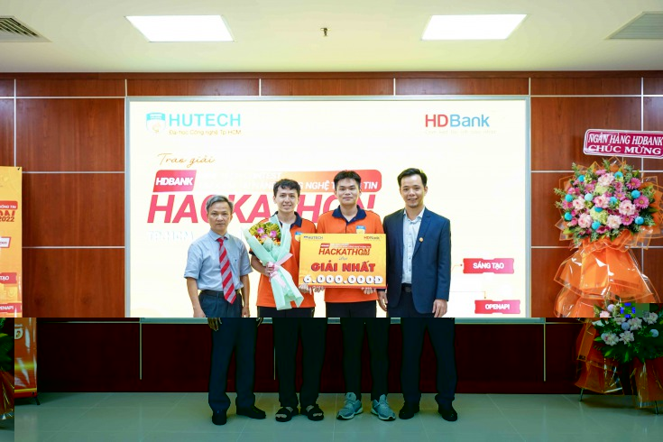                            | 2022                              | [Link](https://www.hutech.edu.vn/homepage/tin-tuc/hoat-dong-sinh-vien/14607882-khoa-cong-nghe-thong-tin-to-chuc-vong-chung-ket-va-le-trao-giai-cuoc-thi-hdbank-hackathon-2022) |
| **Student of 5 Merits Level School 2022**     | Recognized as a student of 5 merits level school in 2022                                                                           | 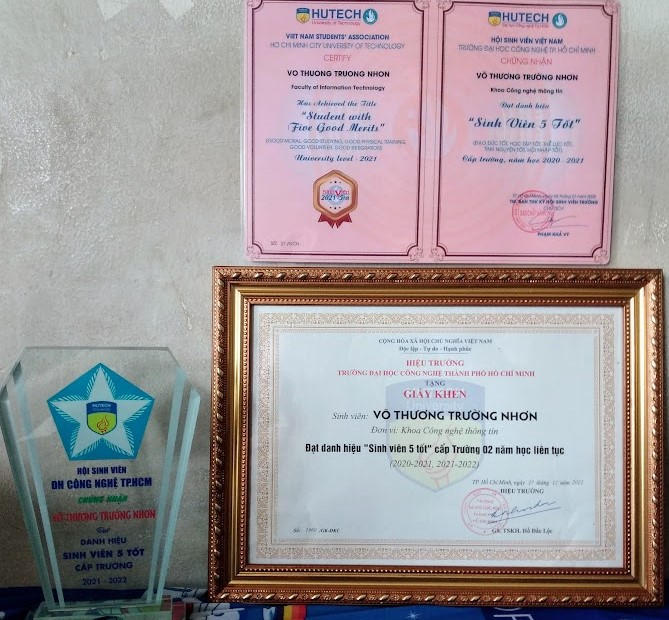                             | 2022                              |                                                                                                                                                                                |
| **Student of 5 Merits Faculty 2022**          | Recognized as a student of 5 merits level faculty in 2022                                                                          |             | 2022                              |                                                                                                                                                                                |
| **HUTECH Talent Scholarship 2022**            | Achieved the top GPA and gained HUTECH Talent Scholarship in 2020                                                                  | 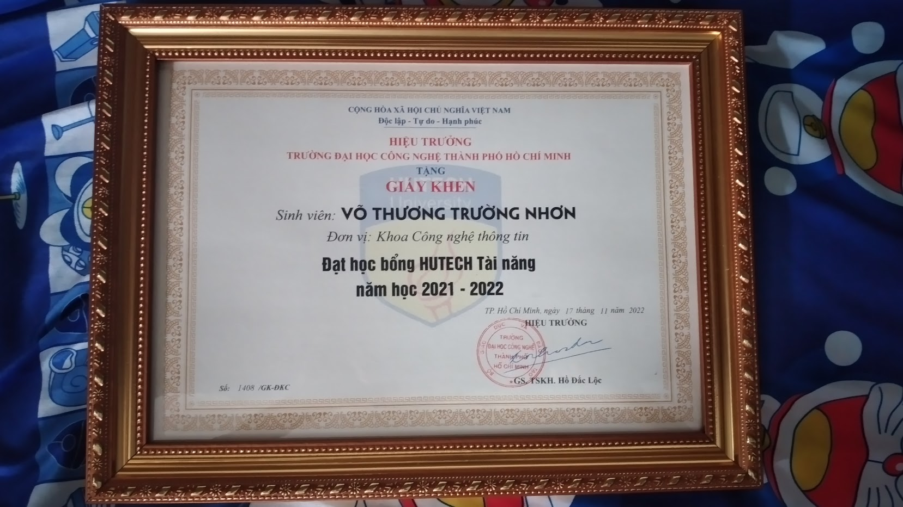              | 2022                              |                                                                                                                                                                                |
| **AI Challenge 2022**                         | Awarded a consolation prize in AI Challenge 2022                                                                                   | 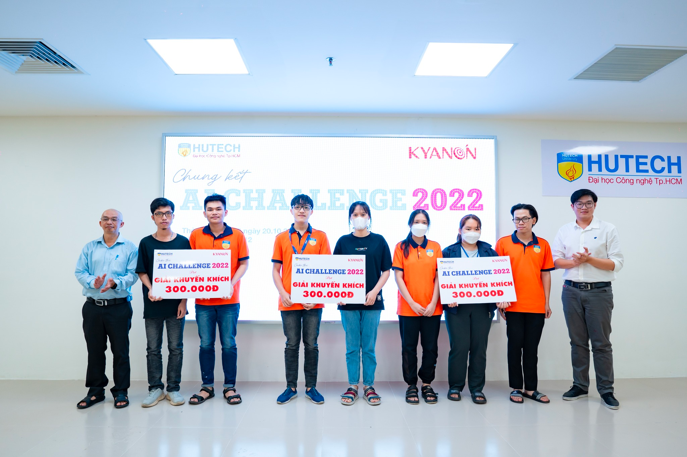                          | 2022                              |                                                                                                                                                                                |
| **My First Website Competition 2022**         | Received a consolation prize in the My First Website Competition                                                                   | 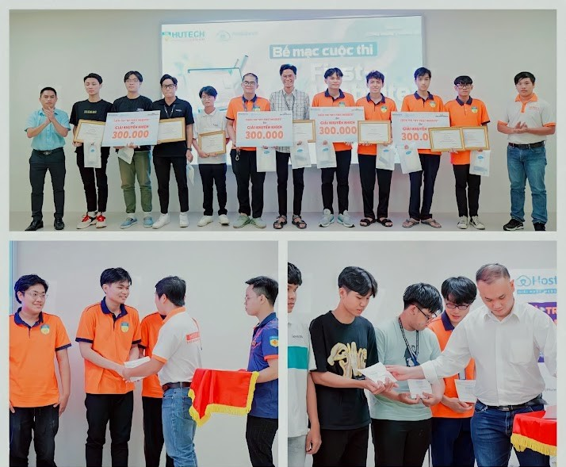                  | 2022                              |                                                                                                                                                                                |
| **English B1 certificate**                    | 440 TOEIC points                                                                                                                   | 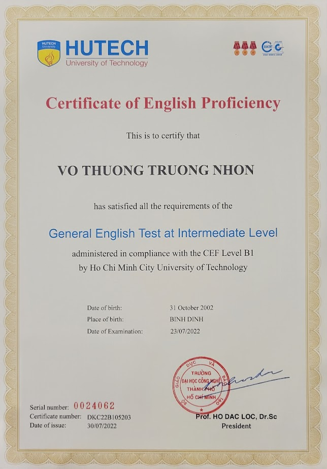                     | 2022                              |                                                                                                                                                                                |
| **HUTECH Talent Scholarship 2021**            | Attained the top 3 GPA and received HUTECH Talent Scholarship in 2021                                                              |               | 2021                              |                                                                                                                                                                                |
| **Student of 5 Merits Level School 2021**     | Acknowledged as a student of 5 merits level school in 2021                                                                         | 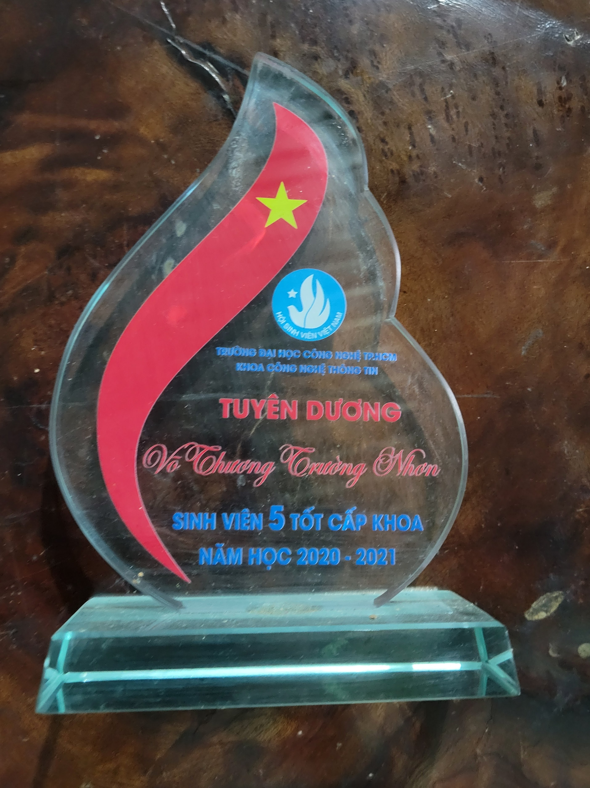             | 2021                              |                                                                                                                                                                                |
| **Student of 5 Merits Faculty Level 2021**    | Acknowledged as a student of 5 merits level faculty in 2021                                                                        |                      | 2021                              |                                                                                                                                                                                |
| **Top typical students semester 1 2021**      | Acknowledged as Top typical students semester 1 2021 with GPA 4.0                                                                  | 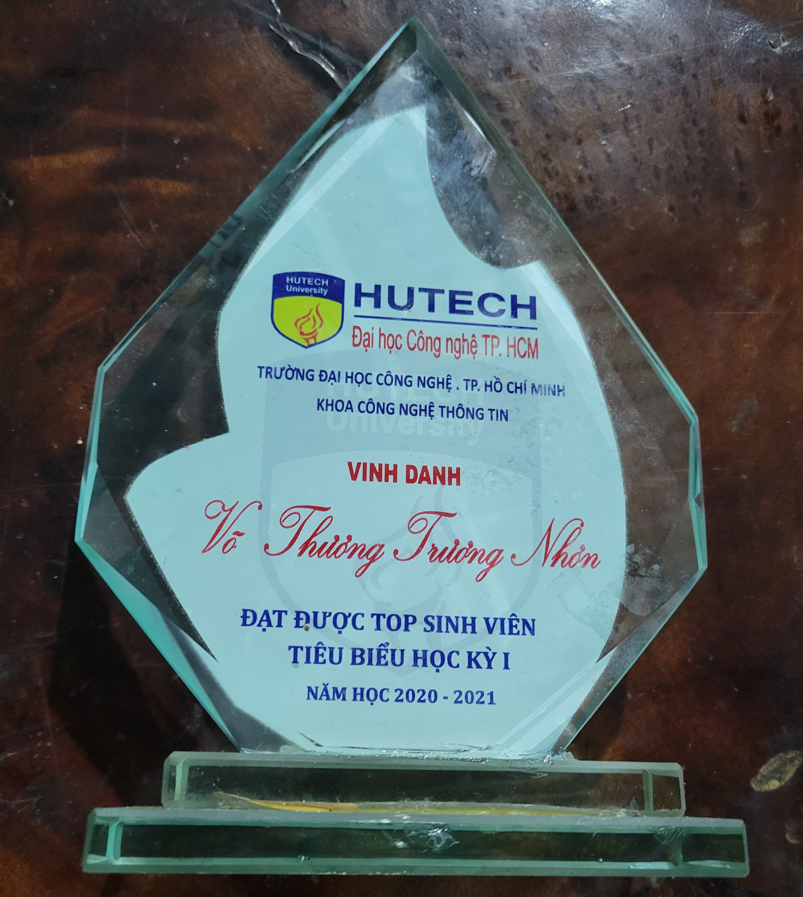                 | 2021                              |                                                                                                                                                                                |
